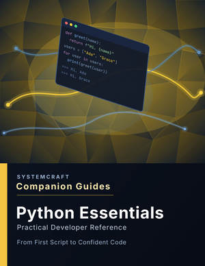

# Python Essentials Companion Guide

_Practical Developer Reference_

From First Script to Confident Code

A concise, practical guide for developers. Part of the SystemCraft™ Companion Guide Series.

## About this Repository



This repository is the companion to the **Python Essentials Companion Guide** — a practical, no-fluff reference for developers who want to actually understand Python, not just copy syntax.

It's free and open: a cheat sheet, quick-reference tables, worked examples, hands-on exercises, and diagrams covering core Python — data types, data structures, control flow, functions, classes, and error handling.

## Topics Covered

- Syntax and core data types
- Data structures: lists, tuples, dictionaries, sets
- Control flow and functions
- Modules, packages, and virtual environments
- Object-oriented Python
- Error handling and debugging
- Quick-reference command and syntax tables
- Scenario-based troubleshooting
- Full Python glossary

## Get the Full Companion Guide

| Format     | Where to Buy | Price |
| ---------- | ------------ | ----- |
| PDF + EPUB | [Payhip](https://payhip.com/b/CdpnI?utm_source=github&utm_medium=readme&utm_content=primary_cta&utm_campaign=python-essentials) | $9.99 |

Use code **GITHUB10** at checkout for 10% off. Learn more at [systemcraftpress.com](https://systemcraftpress.com/guides/python-essentials/?utm_source=github&utm_medium=readme&utm_content=learn_more&utm_campaign=python-essentials).

The full guide adds the material this repo doesn't cover for free: the complete 11-section walkthrough, scenario-based troubleshooting for common panic moments, and the full Python glossary.

## From the Blog

[How to Read a Python Traceback Without Panicking](https://systemcraftpress.com/blog/how-to-read-a-python-traceback/?utm_source=github&utm_medium=readme&utm_content=blog_post&utm_campaign=python-essentials) — a free walkthrough of reading a traceback bottom-to-top instead of panicking at the wall of red text, pulled from this guide.

## What Is In This Repo

- **`cheatsheet/`** — a free one-page Python cheat sheet: core types, data structures, control flow, and golden rules
- **`reference/`** — quick-reference tables: string/list/dict methods, built-in functions, common exceptions, virtual environment commands
- **`examples/`** — worked examples: choosing the right data structure, error handling done properly, a small class in practice, a full project-setup workflow
- **`exercises/`** — hands-on practice: list/dict manipulation, writing a function with real error handling, building a small class
- **`diagrams/`** — visual diagrams for choosing a data structure, the exception-handling flow, and project setup
- **`preview/`** — a look at the full Companion Guide's cover and interior layout

## Repository Structure

```
python-essentials/
├── README.md
├── LICENSE.md
├── cheatsheet/
│   └── python-essentials-cheatsheet.md
├── reference/
│   └── quick-reference.md
├── examples/
│   ├── 01-choosing-a-data-structure.md
│   ├── 02-error-handling-in-practice.md
│   ├── 03-a-small-class-in-practice.md
│   └── 04-project-setup-workflow.md
├── exercises/
│   ├── 01-list-and-dict-warmup/
│   ├── 02-write-a-function-with-error-handling/
│   └── 03-build-a-small-class/
├── diagrams/
│   ├── data-structure-decision.md
│   ├── exception-handling-flow.md
│   └── project-setup-flow.md
└── preview/
    ├── cover.png
    ├── cover-thumbnail.png
    └── page-spread.png
```

## The Essentials Series

| Guide                     | GitHub                                                               | Buy      |
| -------------------------- | --------------------------------------------------------------------- | -------- |
| Git & GitHub              | [Repo](https://github.com/SystemCraftPress/git-github)                | [Payhip](https://payhip.com/b/FWnfc?utm_source=github&utm_medium=readme&utm_content=series_table&utm_campaign=git-github) |
| **Python Essentials**       | **You are here**                                                       | [Payhip](https://payhip.com/b/CdpnI?utm_source=github&utm_medium=readme&utm_content=series_table&utm_campaign=python-essentials) |
| JavaScript Essentials     | [Repo](https://github.com/SystemCraftPress/javascript-essentials)     | [Payhip](https://payhip.com/b/4fWhP?utm_source=github&utm_medium=readme&utm_content=series_table&utm_campaign=javascript-essentials) |
| Command Line Essentials   | [Repo](https://github.com/SystemCraftPress/command-line-essentials)   | [Payhip](https://payhip.com/b/xRFni?utm_source=github&utm_medium=readme&utm_content=series_table&utm_campaign=command-line-essentials) |
| SQL Essentials            | [Repo](https://github.com/SystemCraftPress/sql-essentials)            | [Payhip](https://payhip.com/b/kiapM?utm_source=github&utm_medium=readme&utm_content=series_table&utm_campaign=sql-essentials) |
| VS Code Essentials        | [Repo](https://github.com/SystemCraftPress/vscode-essentials)         | [Payhip](https://payhip.com/b/mw3vu?utm_source=github&utm_medium=readme&utm_content=series_table&utm_campaign=vscode-essentials) |

## About SystemCraft™ Press

SystemCraft™ Press publishes practical, developer-focused learning resources designed to build understanding — not just memorization.

Each Companion Guide combines concise explanations, real-world examples, troubleshooting advice, quick-reference material, and printable cheat sheets to help developers become more confident with the tools they use every day.

This repository accompanies the **Python Essentials Companion Guide** and provides supplemental resources, examples, and updates that complement the book.

Learn more about the Companion Guides series at the links above.

Want new posts and the occasional discount code by email? [Subscribe to the newsletter](https://systemcraftpress.com/blog/?utm_source=github&utm_medium=readme&utm_content=newsletter&utm_campaign=python-essentials).

## License

This repository contains proprietary documentation, branding, and educational content owned by SystemCraft™ Press.

Code examples are provided for educational use and may be used in your own software projects. The accompanying Companion Guide ebook is a commercial publication and is not included in this repository.

See the [LICENSE](LICENSE.md) file for complete terms.
