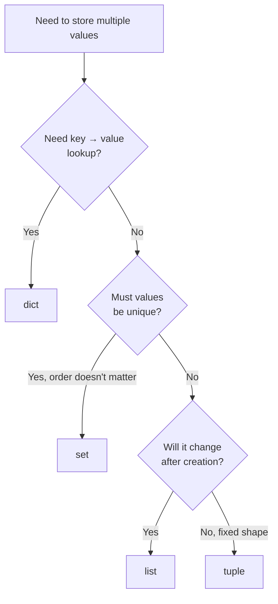

# Diagram: Choosing a Data Structure

The decision process from [Example 1](../examples/01-choosing-a-data-structure.md), as a flowchart.

Most everyday Python code lives in `list` and `dict`. Reach for `set` when uniqueness is the point, and `tuple` when "this should never change" is part of the meaning, not just a preference.
