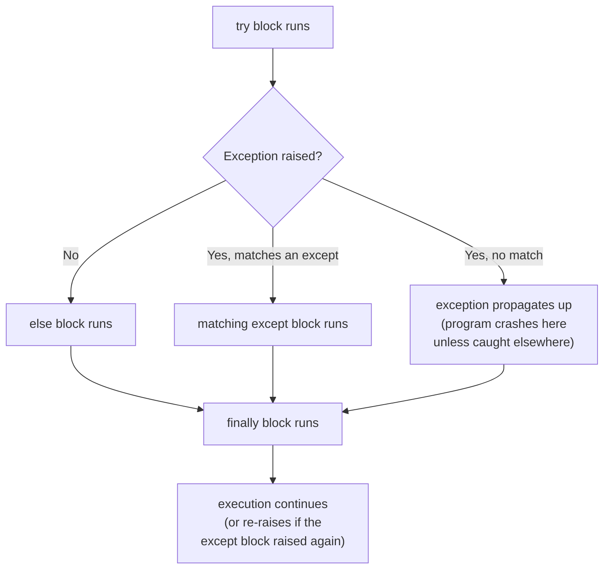

# Diagram: The try/except/else/finally Flow

How Python actually executes each block, from [Example 2](../examples/02-error-handling-in-practice.md).

`finally` runs no matter what happened above it — success, a caught exception, or an uncaught one propagating through. That's what makes it the right place for cleanup (closing files, releasing locks) that must happen either way.
