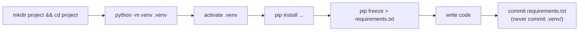

# Diagram: New Project Setup Flow

The sequence from [Example 4](../examples/04-project-setup-workflow.md).

The `.venv` folder itself never gets committed — `requirements.txt` is what makes the environment reproducible for anyone else who clones the project.
